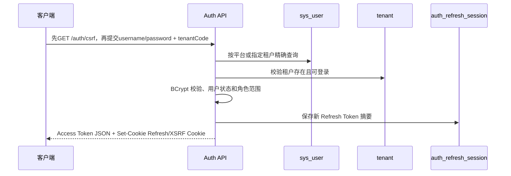
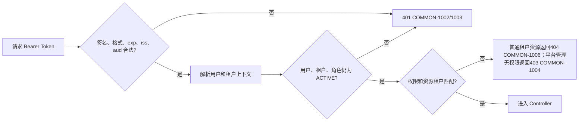
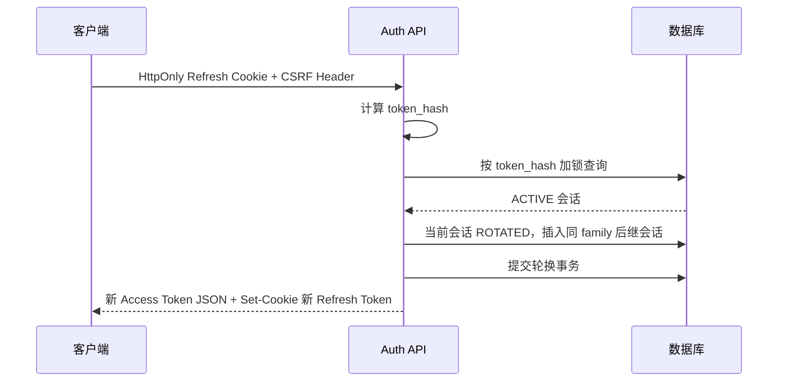
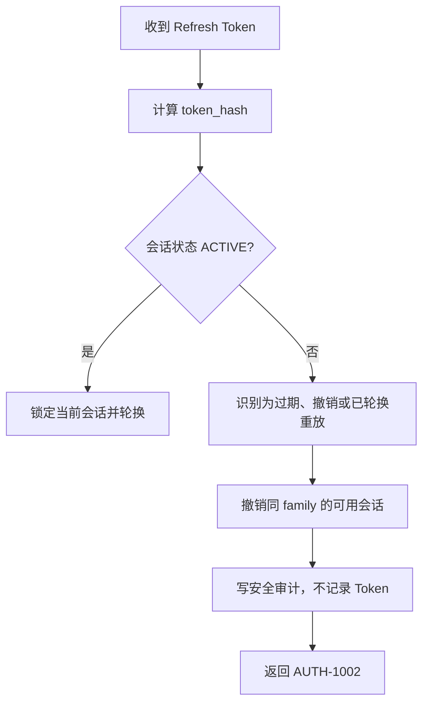
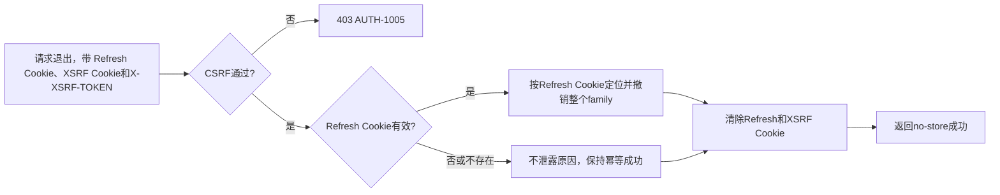
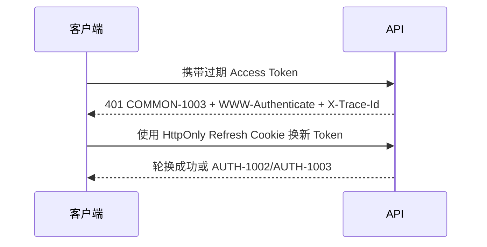
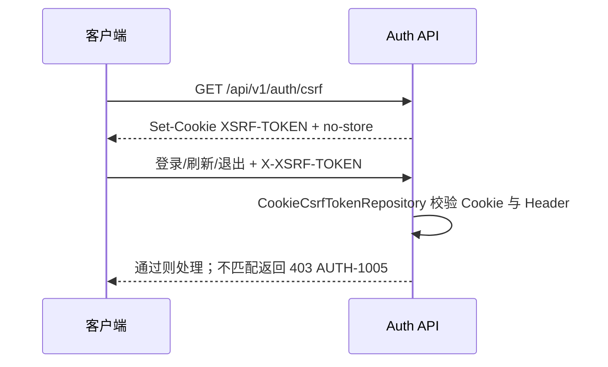
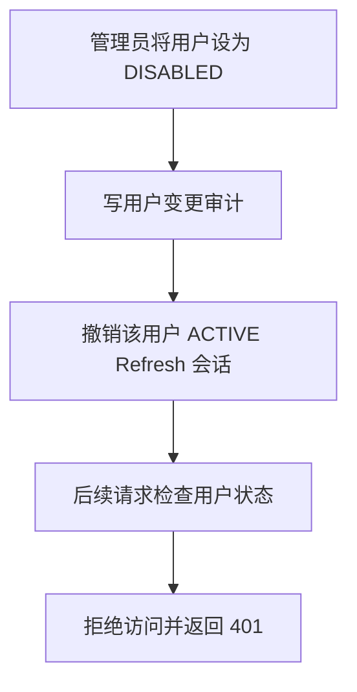

# ShipFlow 认证、RBAC 与租户隔离设计

## 1. 文档定位与边界

本文是认证、基于角色的访问控制（RBAC）和租户隔离的设计方案，不是实现说明。当前分支只修订设计文档和 API 契约，不创建 Java 类、不修改数据库迁移。

设计依据包括 `docs/00` 至 `docs/13`、`openapi/shipflow-api.yaml`、`docs/10-error-codes.md`、`database/schema.sql`、`database/init_data.sql`、V002/V003 迁移，以及当前 Spring Boot 基础骨架。

`shipflow-api.yaml` 中的业务接口仍是计划中的设计契约；当前运行时只有基础设施，尚无登录、JWT、RBAC 或业务 Controller。

## 2. 认证业务目标

第一版认证需要支持：

- 用户名密码登录；
- 使用短时 Access Token 访问受保护接口；
- 使用 Refresh Token 换取新 Token；
- Refresh Token 轮换、重放检测和会话撤销；
- 退出登录；
- 平台用户与租户用户的明确区分；
- 用户禁用后拒绝继续访问，并保留安全审计。

暂不支持短信/邮箱登录、第三方 OAuth/OIDC、多因素认证、设备指纹、单点登录、完整密码找回流程和 Redis 分布式限流。上述能力留待后续阶段评审。

### 2.1 参与方与身份范围

| 身份 | `sys_user.tenant_id` | 典型角色 | 数据范围 |
|---|---:|---|---|
| 平台管理员 | `NULL` | `PLATFORM_ADMIN` | 平台公共对象；经授权可跨租户管理 |
| 商家管理员 | 租户 ID | `MERCHANT_ADMIN` | 本租户 |
| 商家操作员 | 租户 ID | `MERCHANT_OPERATOR` | 本租户的订单操作范围 |
| 仓库人员 | 租户 ID | `WAREHOUSE_OPERATOR` | 本租户仓储操作范围 |
| 财务人员 | 租户 ID | `FINANCE_OPERATOR` | 本租户账单、对账范围 |
| Mock 物流商系统账号 | `NULL` | `MOCK_LOGISTICS_SYSTEM` | 仅物流回调入口，不是商家用户 |

## 3. 认证流程

### 3.1 登录流程

`tenantCode` 为空时只能查找平台用户；非空时只能在指定租户内查找，禁止跨所有租户模糊搜索 `username`。用户不存在、密码错误、tenantCode 错误、用户禁用、租户禁用和系统账号尝试登录，统一返回 `AUTH-1001`，不泄露用户是否存在或状态。成功登录写入审计日志，但不记录密码或 Token。

登录、刷新和退出都必须携带可读取的 `XSRF-TOKEN` Cookie 及匹配的 `X-XSRF-TOKEN` 请求头。`GET /auth/csrf` 匿名可访问，只设置 XSRF Cookie，不返回 Refresh Token，并返回 `Cache-Control: no-store`。CSRF 令牌由 Spring Security `CookieCsrfTokenRepository` 管理，不自定义算法或过滤器。

### 3.2 Access Token 鉴权流程

服务端从 JWT 和数据库状态建立 `SecurityContext` 与 `TenantContext`。客户端传入的 `tenant_id` 不覆盖上下文。

### 3.3 Refresh Token 轮换流程

单次轮换在一个数据库事务内完成。`auth_refresh_session.previous_session_id` 和唯一约束保证一个会话最多产生一个后继会话。

### 3.4 Refresh Token 重复使用检测

重复使用不返回旧结果，也不再次发放 Token；它是安全事件。并发刷新由行锁、事务和 `UNIQUE(previous_session_id)` 共同兜底，竞争方必须重新读取结果并按重放策略处理。

### 3.5 退出登录流程

退出接口已进入 OpenAPI 设计契约，但尚未实现运行时 Controller。退出只能通过 Refresh Cookie 定位 family；Access Token 只是可选审计身份，不能单独定位或撤销 family。Refresh Cookie 不存在、过期、已撤销或数据库不存在时不泄露原因，清除客户端 Cookie 并保持幂等成功。`logout` 不需要 `auth:logout` 权限，`logout-all` 留待后续。

### 3.6 Token 过期流程

Access Token 过期不自动延长；Refresh Token 仍有效时由客户端主动刷新。服务端允许不超过 60 秒的时钟偏差，系统统一使用 UTC。

### 3.8 CSRF流程

登录成功和刷新成功时轮换 Refresh Cookie；XSRF Cookie 不因登录或刷新响应而轮换，只由 CSRF 获取接口生成或按 Spring Security 仓储策略维护。退出成功清除 Refresh Cookie 和 XSRF Cookie。

### 3.7 用户禁用后的处理

禁用动作应在同一业务事务中更新用户状态、撤销活动会话并记录审计。已签发但尚未过期的 Access Token 不能绕过用户状态检查；若未来采用短时缓存，缓存最长有效时间必须小于 Access Token 剩余生命周期。

## 4. JWT 设计

### 4.1 推荐方案

Access Token 固定使用 **RS256（RSA-SHA256）**，有效期固定为 15 分钟。私钥只由签发服务读取，资源服务只需要公钥验证，适合后续服务拆分和密钥轮换；拒绝 `alg=none` 及其他算法。Refresh Token 固定为 32 字节安全随机不透明值，不做成可解析 JWT。

Refresh Token 所属 family 固定绝对有效期 30 天：根会话创建时确定 `expires_at`，所有后继会话继承根会话的 `expires_at`，刷新不能重新延长 30 天。

### 4.2 Claims

| Claim | 设计 |
|---|---|
| `iss` | ShipFlow 认证服务标识 |
| `sub` | 用户 BIGINT ID 的字符串表示 |
| `aud` | API 受众 |
| `iat` / `nbf` / `exp` | UTC Unix 秒，签发、生效和过期时间 |
| `jti` | Token 唯一 ID，用于审计和撤销关联 |
| `tenant_id` | 租户用户为字符串 ID；平台用户省略该 Claim |
| `scope` | `PLATFORM` 或 `TENANT` |
| JOSE Header `kid` | 公钥轮换时的密钥版本，位于 Header，不是 Claims |

第一版不把 `roles` 或完整权限集合写入 Token。接口授权必须从数据库加载当前用户、角色和权限状态，避免禁用角色或回收权限后旧 Token 继续生效。

密钥从环境变量指向的外部文件或密钥管理系统加载，例如 `SHIPFLOW_JWT_PRIVATE_KEY_FILE`、`SHIPFLOW_JWT_PUBLIC_KEY_FILE`，不写入仓库、日志、配置示例或数据库。RS256 私钥不得在启动时随机生成，否则重启会使全部 Token 失效。

服务端固定校验算法、`typ`、`iss`、`aud`、签名、`exp` 和 `nbf`；允许最多 60 秒时钟偏差，生产环境应使用 NTP。密钥轮换期间通过 `kid` 同时保留旧公钥和新公钥验证，签发只使用新私钥；旧公钥在所有旧 Token 过期后再下线。

## 5. Refresh Token 持久化

### 5.1 与现有表的对应

`auth_refresh_session` 已在 V002/schema.sql 中定义，V003只修复注释。当前表包含 `user_id`、可空 `tenant_id`、`token_hash`、`family_id`、`previous_session_id`、状态、过期和撤销时间，并有 `token_hash`、`previous_session_id` 唯一约束。

- 只保存 HMAC-SHA256 摘要，摘要是 64 位十六进制字符串；数据库泄露时不能直接得到明文 Refresh Token。HMAC 密钥从环境变量或外部密钥文件加载，不能进入 Git；
- `family_id` 把一条轮换链关联起来，便于检测重放后撤销整个链；
- `previous_session_id` 表示后继关系，限制同一节点只能有一个后继；
- `ACTIVE` 可轮换，`ROTATED` 已被正常使用，`REVOKED` 被主动或安全策略撤销，`EXPIRED` 超过有效期；`expires_at` 是拒绝过期 Token 的权威判断，状态可由访问时更新或清理任务维护，不能依赖定时任务才能拒绝；
- `tenant_id` 与用户所属租户一致；平台用户为空；服务端不得信任客户端传入值。

### 5.2 事务与并发

轮换事务为：计算摘要 → `SELECT ... FOR UPDATE` 查询会话 → 校验用户、租户、状态和 `expires_at` → 将旧会话改为 `ROTATED` → 插入同 family 且继承根 `expires_at` 的新会话 → 提交。任何一步失败都回滚，不产生半条链。

并发请求争用同一会话时，数据库锁和唯一约束保证最多一个后继。应用不能通过重试插入来制造第二个后继；必须重新读取并按“已轮换 Token 重放”规则处理。

ROTATED Token 再次使用时严格撤销整个 `family_id`，记录不含 Token、密码或 HMAC 摘要的安全审计，返回 `AUTH-1002`。客户端必须串行刷新；网络重试旧 Token 可能触发重放策略并要求重新登录。`/logout` 撤销当前 family；`logout-all` 留作后续接口。

本轮不新增字段和索引。MySQL 是唯一持久化来源；Redis 后续可用于限流、短期撤销缓存和多实例热点状态，但不能替代数据库轮换事务。

## 6. RBAC 权限设计

### 6.1 授权关系

`sys_user 1:N sys_user_role N:1 sys_role 1:N sys_role_permission N:1 sys_permission`。用户通过角色间接获得权限；角色和用户均必须为 `ACTIVE`，且角色作用域与用户作用域匹配。

- `PLATFORM` 角色的 `tenant_id` 必须为空；
- `TENANT` 角色的 `tenant_id` 必须非空；
- 租户用户只能获得本租户 TENANT 角色；
- 平台用户可获得平台角色，Mock 回调账号只获得 `tracking:callback`；
- 管理员分配角色时必须再次检查角色归属，不能只依赖前端列表。

接口计划通过权限标识授权，例如 `@PreAuthorize("@permissionEvaluator.has(authentication, 'order:create')")`。这只是计划写法，本轮不创建注解或实现类。

### 6.2 角色权限矩阵

以下与 `init_data.sql` 的测试数据对齐：

| 角色 | 主要权限 |
|---|---|
| `PLATFORM_ADMIN` | `tenant:create`、`user:manage`、`audit:read` |
| `MERCHANT_ADMIN` | `user:manage`、`order:create`、`order:operate`、`audit:read` |
| `MERCHANT_OPERATOR` | `order:create`、`order:operate` |
| `WAREHOUSE_OPERATOR` | `warehouse:measure`、`warehouse:outbound` |
| `FINANCE_OPERATOR` | `finance:bill-import`、`finance:reconcile`、`audit:read` |
| `MOCK_LOGISTICS_SYSTEM` | `tracking:callback` |

平台公共物流商、渠道和权限由平台维护；租户用户不能修改其基础配置。平台管理员的跨租户操作仍需明确目标租户、执行归属校验并写平台级审计。

用户或角色变为 `DISABLED` 后，新的鉴权必须拒绝；已建立的 SecurityContext 不应跨请求复用。角色权限变更在下一次请求生效，不允许仅依赖 JWT 内的旧权限。

### 6.3 Mock 回调账号

物流回调使用 `providerHmac`，签名凭证由 Mock 系统账号与物流商配置在应用安全配置中映射。该账号禁止用户名密码登录，只能访问回调入口并通过 `tracking:callback` 进行事件处理。登录服务必须显式排除该账号；回调主体不得返回签名、原始密钥或内部堆栈。

### 6.4 当前权限加载与 N+1 控制

每个受保护请求都必须检查用户 `ACTIVE`、所属租户 `ACTIVE`、关联角色 `ACTIVE` 和当前权限。第一版不缓存权限，每个请求从数据库加载当前状态；实现时不能为每个角色或权限逐条查询：使用一次带 JOIN 的用户-角色-权限查询，或按用户批量加载后在请求内建立权限集合；同一请求不得产生逐角色、逐权限 N+1 查询。Redis 阶段再增加短 TTL 权限缓存。

### 6.5 第二阶段冻结权限矩阵

第二阶段覆盖平台租户、租户店铺、租户用户和角色权限管理。所有接口均要求登录；写接口还要求认证模块既有的 CSRF 双提交校验。权限由实时加载的 permission codes 判断，前端隐藏菜单不构成授权控制。

| 接口组 | scope | 权限码 | PLATFORM_ADMIN | MERCHANT_ADMIN | MERCHANT_OPERATOR | WAREHOUSE_OPERATOR | FINANCE_OPERATOR | MOCK_LOGISTICS_SYSTEM |
|---|---|---|---|---|---|---|---|---|
| `POST /platform/tenants` | PLATFORM | `tenant:create` | 允许 | 403 | 403 | 403 | 403 | 403 |
| `GET /platform/tenants`、`/{tenantId}` | PLATFORM | `tenant:read` | 允许 | 403 | 403 | 403 | 403 | 403 |
| `PUT /platform/tenants/{tenantId}`、`/status` | PLATFORM | `tenant:manage` | 允许 | 403 | 403 | 403 | 403 | 403 |
| `GET /stores`、`/stores/{storeId}` | TENANT | `store:read` | 不适用 | 允许 | 允许 | 403 | 403 | 403 |
| `POST /stores`、`PUT /stores/{storeId}`、`/status` | TENANT | `store:manage` | 不适用 | 允许 | 403 | 403 | 403 | 403 |
| `/users` 的查询、详情、创建、修改、状态、角色绑定 | TENANT | `user:manage` | 不适用 | 允许 | 403 | 403 | 403 | 403 |
| `GET /roles`、`/roles/{roleId}` | TENANT | `role:read` | 不适用 | 允许 | 403 | 403 | 403 | 403 |
| `GET /permissions` | TENANT | `permission:read` | 不适用 | 允许 | 403 | 403 | 403 | 403 |
| `PUT /roles/{roleId}/permissions` | TENANT | `role:manage` | 不适用 | 允许 | 403 | 403 | 403 | 403 |

“不适用”表示该角色没有租户上下文，不能通过该租户资源接口操作。跨租户店铺、用户、角色资源按 404 隐藏；已认证但访问平台路径或无当前动作权限时使用403。

### 6.6 JWT、当前用户和角色数据边界

现有 Access Token 只包含 `sub`、`scope` 和租户身份的 `tenant_id`，不含 roles 或 permissions。此约束保持：请求通过 JWT 解码后，调用 `LoginIdentityService.reloadByUserId(userId, tenantId)` 重新加载用户、租户、角色有效性和权限，作为授权输入。

`CurrentUserResponse` 当前只返回 permissions，不返回 roles；第二阶段暂不改变已验收的 `/users/me` 响应。角色信息由 `GET /api/v1/roles` 和 `GET /api/v1/roles/{roleId}` 查询；后端授权绝不依赖 `/users/me` 的响应或前端缓存。

### 6.7 第二阶段事务、租户一致性和审计

- 所有租户 SQL 必须携带 `tenant_id` 并过滤 `deleted=0`。资源更新必须使用 `WHERE id=? AND tenant_id=? AND deleted=0 AND version=?`，成功时 `version=version+1`。平台 `tenant` 更新使用 `id=? AND deleted=0 AND version=?`。
- 创建租户、初始管理员、初始租户管理员角色和用户角色关系必须在一个事务内完成，任一步失败全部回滚。
- 创建用户和用户角色绑定、替换用户角色、替换角色权限都必须在单事务中完成。`sys_user_role` 外键不能保证 user、role、relation 的 tenant 一致，服务必须验证三者同租户、角色为 ACTIVE、role_scope=TENANT、deleted=0。
- `sys_role_permission` 没有 tenant_id，绑定与查询都必须经 `sys_role` 校验当前 tenant、role_scope 和角色状态。
- 创建租户、店铺、用户以及基础信息修改要求 `Idempotency-Key`；状态和绑定操作以 version 乐观锁作为重试/冲突边界。
- 停用租户后不修改已签发 Access Token，但每个请求实时重载身份并立即拒绝。
- 最小审计字段为 trace_id、UTC 时间、operator_user_id、operator_tenant_id、operation、resource_type、resource_id、target_tenant_id、结果、错误码、Idempotency-Key 摘要及非敏感变更摘要；不记录 temporaryPassword、password_hash、Token、Cookie 或完整请求体。

### 6.8 实施前置条件

当前 `SecurityConfig` 对未知路径为 `anyRequest().permitAll()`；第二阶段 Java 实施的第一项必须将所有管理路径置于 authenticated 下，并建立基于实时权限的统一授权入口。当前初始化权限字典未包含完整的 `tenant:read`、`tenant:manage`、`store:read`、`store:manage`、`role:read`、`role:manage`、`permission:read`，必须先通过受控迁移和角色绑定补齐，不能用角色名称字符串替代权限判断。

## 7. 租户隔离

1. 租户上下文来自已验证身份：租户用户取 JWT/数据库主体中的 `tenant_id`；平台用户为平台作用域。请求参数、查询参数和普通 Header 中的 `tenant_id` 不产生授权作用。
2. 租户接口不得接受调用方任意指定租户；平台管理接口统一使用显式 `/api/v1/platform/.../{tenantId}` 路径和 `tenantId` 路径参数。普通 `X-Tenant-Id` Header 不能决定授权范围。
3. MyBatis 查询必须把 `tenant_id = 当前上下文` 作为条件。计划使用 Mapper 约定、代码评审和拦截器静态检查共同防止漏条件；不能只依赖前端传参。
4. 新增时从上下文写入 `tenant_id`；修改、逻辑删除和关联查询同时校验资源租户、父对象租户和操作者权限。
5. 租户用户访问其他租户 ID 即为水平越权，统一返回 `COMMON-1006`（404），避免泄露资源存在性。平台管理接口无权限时返回 403，并写平台级审计；平台管理员必须通过显式路径访问目标租户。
6. `TenantContextHolder` 使用请求级 ThreadLocal，在认证完成后创建，在 Filter `finally` 中清理。不得把上下文泄露到线程池。
7. 异步任务必须显式携带租户快照和操作者信息，执行前设置、执行后清理；不能假设 ThreadLocal 自动传递。
8. 审计日志的 `tenant_id` 为租户业务审计时的真实租户 ID，平台级审计为空；同时记录操作者、资源、动作、结果和 `traceId`。

### 7.1 关系约束

| 关系 | 约束 |
|---|---|
| 用户—租户 | `sys_user.tenant_id` 为空表示平台用户，否则必须引用有效租户 |
| 角色—租户 | `PLATFORM` 角色为空，`TENANT` 角色非空 |
| 用户—角色 | 角色作用域必须与用户作用域一致 |
| 订单及业务数据 | 所有租户业务查询、写入和关联校验使用同一 `tenant_id` |
| 审计 | 平台操作可为空，租户操作必须有租户 ID |

## 8. 安全设计

- 密码使用 BCrypt 校验和保存；明文只存在于登录请求内存，禁止写响应、日志、审计或数据库。
- 登录失败统一 `AUTH-1001`，不区分用户不存在、密码错误和被禁用的细节；内部审计保留必要原因但不保留密码。
- 第一版只定义 IP、用户名、租户维度限流和失败退避策略；分布式限流等待 Redis 阶段实现。在 Redis 限流完成前，不将系统描述为生产安全就绪。
- Authorization、Refresh Token、JWT 密钥、HMAC 密钥和完整签名全部脱敏或不记录。
- MyBatis 使用参数绑定，禁止拼接用户输入形成 SQL；排序字段采用白名单映射。
- CORS 使用环境变量配置的允许来源，不允许 `*` 配合凭证。登录、刷新和退出接口必须同时携带 `XSRF-TOKEN` Cookie 与 `X-XSRF-TOKEN` 请求头，由 Spring Security `CookieCsrfTokenRepository` 校验；CSRF 失败统一返回 `403 AUTH-1005`。Refresh Cookie 保持 HttpOnly；生产环境 Refresh Cookie 使用 HttpOnly、Secure、SameSite=Strict、明确 Path 和 Max-Age，XSRF Cookie 使用 Secure、SameSite=Strict、明确 Path 和 Max-Age；两者均不设置 Domain。local/test 可关闭 Secure，生产必须开启。
- 登录、刷新和退出响应统一返回 `Cache-Control: no-store`，禁止浏览器、代理和客户端缓存凭证相关响应。Access Token 通过 JSON 返回，前端只保存在内存；Refresh Token 只通过 HttpOnly Cookie 返回，不进入 JSON 或 LocalStorage。
- 401 表示缺少、无效、过期或不可接受的身份凭证；403 表示身份有效但无权限或不满足租户范围。
- 所有响应包含 `X-Trace-Id`，安全审计也保存 traceId；traceId 不应包含用户输入中的密码、Token 或隐私数据。
- 数据库连接、JWT 私钥、公钥、BCrypt 参数、HMAC 密钥和 CSRF 配置仅从环境变量、外部文件或密钥管理系统加载，禁止提交 Git。审计失败不能把 Token、密码或 HMAC 摘要写入错误消息或日志；应保留可检索的 traceId 和脱敏失败类别。

## 9. 认证接口设计核对

下表区分“当前设计契约”和“尚未实现”。`api_idempotency_record` 不用于认证、Token 和密码接口。

| 接口 | 方法与 URL | 请求头/请求体 | 成功响应 | 主要错误码 | 权限/Token | 幂等控制 |
|---|---|---|---|---|---|---|
| 获取CSRF | `GET /api/v1/auth/csrf` | 匿名；无请求体 | 设置可读 `XSRF-TOKEN` Cookie；不返回 Refresh Token；`Cache-Control: no-store` | `COMMON-1008` | 匿名；不需要 Access Token | 只读；不使用通用缓存 |
| 登录 | `POST /api/v1/auth/login` | `Content-Type: application/json`；`XSRF-TOKEN` Cookie；`X-XSRF-TOKEN`；`username`、`password`、可选 `tenantCode` | `ApiSuccess<TokenResponse>` + Set-Cookie Refresh/XSRF | `AUTH-1001`、`AUTH-1005`、`COMMON-1008` | 匿名；不需要 Access Token | 不使用通用幂等缓存；`Cache-Control: no-store` |
| 刷新 Token | `POST /api/v1/auth/refresh` | Refresh HttpOnly Cookie；`XSRF-TOKEN` Cookie；`X-XSRF-TOKEN` | 新 `accessToken` JSON + Set-Cookie 新 Refresh；XSRF Cookie按仓储策略维护 | `AUTH-1002`、`AUTH-1003`、`AUTH-1005`、`COMMON-1008` | 不需要 Access Token；需要 Cookie 和 CSRF | 不使用通用缓存；客户端必须串行刷新；`no-store` |
| 退出登录 | `POST /api/v1/auth/logout` | Refresh Cookie；`XSRF-TOKEN` Cookie；`X-XSRF-TOKEN`；Access Token可选仅用于审计 | 清除 Refresh/XSRF Cookie；已撤销/过期/不存在仍成功 | `AUTH-1005`、`COMMON-1008` | 不要求 `auth:logout`；只能由 Refresh Cookie 定位 family | 业务状态幂等；撤销当前 family；`no-store` |
| 当前用户 | `GET /api/v1/users/me` | `Authorization: Bearer` | 用户、角色、权限和租户摘要 | `COMMON-1002`、`COMMON-1003` | 需要 Access Token；登录用户本人 | 只读，不需要 |

登录、刷新和退出响应不缓存。退出无需独立 `auth:logout` 权限；服务端只能从 Refresh Cookie 定位 family，Access Token 仅作可选审计身份。上述接口仍是设计契约，当前运行时没有业务 Controller。

## 10. 计划中的 Java 实现结构

本轮不创建以下类；每个类只有在对应业务流程评审通过后再实现。

| 层次 | 计划类 | 职责 |
|---|---|---|
| Controller | `AuthController`、`CurrentUserController` | 接收 DTO、调用用例、返回统一响应；不写 SQL 和权限业务 |
| Service | `AuthService`、`RefreshTokenService`、`LogoutService`、`CurrentUserService` | 编排登录、轮换、撤销和用户摘要事务 |
| Mapper | `SysUserMapper`、`TenantMapper`、`AuthRefreshSessionMapper`、角色/权限 Mapper、`AuditLogMapper` | 参数化查询和必要的租户条件 |
| Entity/DO | `SysUserDO`、`TenantDO`、`SysRoleDO`、`SysPermissionDO`、关系 DO、`AuthRefreshSessionDO`、`AuditLogDO` | 数据库映射，不直接作为 API 输出 |
| DTO | `LoginRequest`、`TokenResponse`、`CurrentUserView` | 只承载实际 JSON 请求/响应字段；Refresh Cookie 和 CSRF Header/Cookie 不伪装成 DTO 字段 |
| Security Filter | Spring Security `BearerTokenAuthenticationFilter`、`TenantContextFilter`、`CookieCsrfTokenRepository` | 由 Resource Server 提取 Bearer、由标准 CSRF 仓储校验 Cookie/Header、建立 SecurityContext/TenantContext、finally 清理；不编写自定义 JWT/CSRF 解析算法或 Filter |
| Authentication Provider | 用户名密码 Provider | 精确租户范围查询、Spring Security `PasswordEncoder`/BCrypt 校验、统一失败错误 |
| JWT Service | `JwtDecoder`、`JwtEncoder`、Nimbus JOSE、Key Loader | 标准库完成签名、校验、Claims 和密钥轮换；固定 RS256 |
| Refresh 组件 | `RefreshTokenHasher` | 生成高熵 Token、摘要和安全比较 |
| Tenant Context | `TenantContextHolder` | 保存请求级租户/平台作用域，不跨线程泄露 |
| Permission Evaluator | `PermissionEvaluator` | 校验权限、角色状态和资源租户 |
| Exception Handler | 现有全局处理器扩展 | 把认证、授权、租户错误映射为统一错误响应 |

## 11. 测试策略

### 11.1 JUnit 与 MockMvc

- BCrypt、JWT Claims、算法/`kid`、时钟偏差、Refresh Token 摘要和权限计算使用 JUnit 单元测试；
- MockMvc 覆盖登录成功、密码错误、平台/租户同名用户、tenantCode 不匹配、当前用户、退出登录；
- 覆盖 Token 缺失、伪造、签名篡改、过期、错误 issuer/audience，以及 401/403 区分；
- 覆盖首次轮换、已轮换 Token 重放、过期/撤销会话、并发刷新只产生一个后继；
- 覆盖角色矩阵、用户禁用、角色禁用、水平越权和平台用户授权边界。

### 11.2 数据库断言

核心测试同时断言响应和数据库：

- 登录产生会话时，`auth_refresh_session` 只有摘要，状态为 `ACTIVE`，没有明文 Token；
- 轮换后旧记录为 `ROTATED`，新记录的 `previous_session_id` 指向旧记录，同一节点没有第二后继；
- 重放后同 family 的活动会话被撤销，并写一条不含敏感值的安全审计；重复重放不重复产生业务影响；
- 用户禁用撤销活动会话，审计的 `tenant_id`、操作者和 traceId 正确；
- 租户用户的查询、写入和关联资源都带正确 `tenant_id`，跨租户请求不泄露数据。

### 11.3 后续接口自动化与报告

后续使用 pytest + requests 覆盖真实 HTTP 流程，不依赖生产数据库；使用轮询验证异步撤销或审计结果，不使用固定长时间 `sleep`。Allure 按 `auth`、`rbac`、`tenant-isolation`、`refresh-rotation`、`security` 标签分类，并分别标记 normal/boundary/exception/permission。

## 12. 学习检查点

在进入认证编码前，应能独立解释并举例：

- Filter Chain：请求经过哪些过滤器、顺序为何重要；
- Authentication：凭证如何被验证并形成主体；
- SecurityContext：如何在一次请求中保存已认证身份；
- JWT：签名、Claims、过期和服务端校验边界；
- BCrypt：单向哈希、盐和密码校验；
- RBAC：用户、角色、权限的关系和作用域；
- Tenant Context：租户从可信身份进入并在请求结束清理；
- 401 与 403：凭证问题与授权问题的区别；
- Refresh Token 轮换：为什么旧 Token 不能重复使用；
- 水平越权与垂直越权：跨租户资源访问与超越角色权限的区别。

## 13. 设计决策清单

1. Access Token 固定 RS256、15 分钟；Claims 最小集合为 `iss`、`sub`、`aud`、`iat`、`nbf`、`exp`、`jti`、`scope`、`tenant_id`（平台用户省略），`kid` 仅在 JOSE Header。
2. Refresh Token 固定为 32 字节安全随机不透明值，HMAC-SHA256 摘要保存为 64 位十六进制字符串。
3. Refresh family 固定绝对有效期 30 天，后继会话继承根 `expires_at`，不能滚动延长。
4. ROTATED Token 重放撤销整个 family；客户端必须串行刷新，网络重试旧 Token 可能要求重新登录。
5. Access Token 进 JSON 内存，Refresh Token 进 HttpOnly Cookie，不进入 JSON 或 LocalStorage；获取 CSRF 后，登录、刷新和退出都要求 `XSRF-TOKEN` Cookie 与 `X-XSRF-TOKEN` Header 匹配。
6. `tenant_id` 从已认证主体取得，平台用户为空，租户用户不得传入或覆盖租户 ID。
7. 权限以数据库当前状态为准，不把角色和权限写入第一版 JWT；通过批量 JOIN 查询避免 N+1。
8. 认证失败不泄露用户存在性；Token、密钥、密码、HMAC 摘要和完整签名不进入日志或审计详情。
9. 认证接口不使用通用幂等响应缓存；登录、刷新、退出使用 `Cache-Control: no-store`。
10. `/logout` 只能通过 Refresh Cookie 定位并撤销当前 family，Access Token 仅作可选审计身份；清除 Refresh/XSRF Cookie，`logout-all` 留待后续。

## 14. 尚未确定、需要负责人选择的问题

1. 是否需要新增 `tenant:read`、`tenant:status`、`price-rule:manage` 等权限；当前初始化权限集合尚未覆盖全部平台运维接口，认证阶段不提前增加。
2. JWT 公私钥采用本地和 Ubuntu 外部挂载 PEM 文件，生产 KMS 作为后续演进，是否接受该第一版边界？

## 15. 数据库与 OpenAPI 缺口

- 当前数据库已支持基本 Refresh Token 轮换，但没有设备、客户端、IP、User-Agent 或最后使用时间字段；本轮不迁移，安全审计可先保存脱敏元数据。
- 当前 `auth_refresh_session.tenant_id` 可空，但需由应用保证与 `sys_user.tenant_id` 一致；数据库没有跨表一致性 CHECK。
- `openapi/shipflow-api.yaml` 的登录、刷新、退出和当前用户仍是计划契约，当前没有运行时 Controller。
- OpenAPI 当前业务接口还未对应运行时 Controller；设计契约不能作为“已实现接口”对外宣称。
- 当前权限种子数据只有 10 个权限，平台租户查询、状态管理、价格规则维护等权限尚未全部建模。
- OpenAPI 的登录响应仍是设计层 TokenResponse；JWT 算法、`kid`、Refresh Session 状态属于实现内部，不应泄露给商家接口。
- `init_data.sql` 的 BCrypt 值静态格式为 60 字符 `$2a$10$` 摘要，但当前环境未完成与明确本地测试密码的 BCrypt 校验；这是登录实现前的阻塞项，必须补充受控的本地测试密码映射。本文不显示或生成任何生产密码。
- 第一版权限不缓存，每个受保护请求从数据库加载用户、租户、角色和权限当前状态；通过一次 JOIN 或批量查询避免 N+1。Redis 阶段再增加短 TTL 权限缓存。
- 第一版 Refresh Token 不绑定设备，登录分布式限流等待 Redis 阶段；在 Redis 限流完成前，系统不得描述为生产安全就绪。

## 16. 实现顺序

1. 先评审并冻结登录、刷新、退出和当前用户的 API 请求/响应及错误码。
2. 实现密钥加载、BCrypt、JWT 校验、统一 401/403 和 Trace ID 集成。
3. 实现用户精确登录查询和平台/租户 `tenantCode` 规则。
4. 实现 Refresh Token 摘要、轮换事务、重放检测和会话撤销。
5. 实现 RBAC 权限查询、角色状态检查和接口权限映射。
6. 实现 Tenant Context、Mapper 租户条件和跨租户审计。
7. 依次接入当前用户、租户用户管理及后续业务模块；每个模块单独评审和测试。
8. 最后接入 pytest、Allure、限流和可选 Redis 增强。

## 17. 测试顺序

1. 纯单元测试：密码、Claims、时间、摘要、角色权限和租户解析。
2. MockMvc：登录、刷新、当前用户、退出和统一错误响应。
3. 数据库集成测试：会话状态、轮换链、唯一约束和审计记录。
4. 安全回归：伪造/篡改/过期 Token、401/403、禁用用户/角色。
5. 租户隔离回归：水平越权、平台跨租户授权、父子资源归属。
6. 并发测试：同一 Refresh Token 同时刷新、重复退出和重复管理请求。
7. pytest + requests 接口测试及 Allure 分类报告。

## 18. 风险清单

| 风险 | 后果 | 控制措施 |
|---|---|---|
| 漏写 tenant 条件 | 跨租户数据泄露 | Mapper 约定、拦截器/静态检查、跨租户测试 |
| 将权限全放 JWT | 禁用或回收不及时 | 每次请求检查当前状态，Token 只放摘要 |
| Refresh Token 重放 | 会话被盗用 | 摘要存储、轮换链、family 撤销和审计 |
| 并发刷新竞态 | 产生多个后继 Token | `FOR UPDATE`、事务、唯一约束和并发测试 |
| 错误码混淆 401/403 | 客户端重试或安全策略错误 | 统一异常映射和 MockMvc 覆盖 |
| 日志泄露 Token/密码 | 凭证泄露 | 脱敏过滤、禁止审计详情记录敏感值 |
| 平台权限过宽 | 垂直越权 | 显式平台权限、目标租户校验、平台审计 |
| 密钥轮换不完整 | Token 全部失效或无法验证 | `kid`、公私钥分离、双钥过渡方案 |
| 多实例限流缺失 | 暴力破解风险 | 后续 Redis 统一限流，本轮先定义接口和指标 |
| 设计契约与运行时混淆 | 错误验收或虚假完成 | 文档和报告明确“计划接口，当前未实现” |
