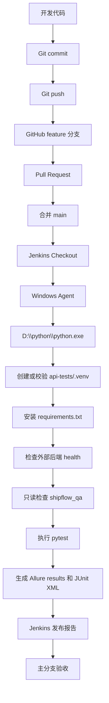

# ShipFlow 认证 API 自动化测试框架学习指南

本文面向需要独立运行、调试和扩展 ShipFlow 接口自动化的测试开发工程师。所有名称均来自当前仓库；运行时生成的 `reports/` 不属于源码。示例只使用环境变量或脱敏占位符。

# 1. 第一模块范围和验收结果

第一模块覆盖以下五个 HTTP 接口：

| 能力 | 方法与路径 | 关键安全点 |
| --- | --- | --- |
| 获取 CSRF | `GET /api/v1/auth/csrf` | 下发 `XSRF-TOKEN` Cookie |
| 密码登录 | `POST /api/v1/auth/login` | 双提交 CSRF、Access Token、HttpOnly Refresh Cookie |
|刷新会话 | `POST /api/v1/auth/refresh` | Refresh Token 轮换、重放防护 |
| 当前用户 | `GET /api/v1/users/me` | Bearer Access Token、当前权限集合 |
| 退出登录 | `POST /api/v1/auth/logout` | 撤销 Refresh family、清除 Cookie |

测试范围包括 Access Token、Refresh Token、Cookie、XSRF Token、JWT 无效/篡改/过期场景、Trace ID，以及用户身份和已加载权限。当前后端能返回 RBAC 权限集合，但尚不能据此声称所有业务接口的端点级 RBAC 策略已经完成。

已确认的验收证据：本地 pytest 为 **90 passed**；Allure 展示 90 个用例且 100% 通过；JUnit 已发布；Windows Jenkins Pipeline 与主分支构建均成功。仓库和 `Jenkinsfile` 不保存 Jenkins 构建编号，因此无法确认具体编号。当前检出分支是 `feature/auth-rbac`。

# 2. 测试项目目录结构

```text
api-tests/
|-- clients/
|   |-- http_client.py
|   |-- auth_client.py
|   `-- user_client.py
|-- common/
|   |-- assertions.py
|   |-- config_loader.py
|   |-- json_path.py
|   |-- logger.py
|   |-- placeholder_resolver.py
|   |-- scenario_context.py
|   `-- token_context.py
|-- config/
|   |-- config.yaml
|   `-- env/ci.yaml
|-- data/auth_data.yaml
|-- executors/
|   |-- action_executor.py
|   |-- assertion_executor.py
|   |-- extractor_executor.py
|   |-- request_executor.py
|   `-- scenario_executor.py
|-- models/api_test_case.py
|-- repositories/api_test_case_repository.py
|-- tests/
|   |-- auth/
|   |-- users/
|   |-- framework/
|   |-- test_case_repository.py
|   |-- test_database_driven_auth.py
|   `-- test_environment.py
|-- reports/                 # 运行时生成，Git 忽略
|-- conftest.py
|-- pytest.ini
`-- requirements.txt
```

框架层是 `clients`、`common`、`executors`、`models`、`repositories` 和 `conftest.py`；业务测试层是 `tests/auth`、`tests/users` 与 QA 数据库中的认证用例。`tests/framework` 测框架自身。`config` 管理非秘密配置入口，`data/auth_data.yaml` 保存可提交的非敏感业务数据，`reports` 保存一次运行的 Allure/JUnit 产物。

# 3. 一条普通接口测试的完整调用链

以 `api-tests/tests/users/test_current_user.py::test_get_current_user_success` 为例：

```text
pytest
-> authenticated_context fixture
-> AuthClient.get_csrf_token() / AuthClient.login()
-> UserClient.get_current_user()
-> HttpClient.get() -> HttpClient.request()
-> requests.Session.request()
-> GET /api/v1/users/me
-> requests.Response
-> test_get_current_user_success 中的 assert
-> allure-pytest 结果
```

`conftest.py::http_client` 以函数作用域创建 `HttpClient`，从 `settings` 注入 `base_url`、`timeout`、`verify_ssl`，测试结束调用 `close()`。`auth_client` 与 `user_client` 都复用同一个 `http_client`，所以同一测试中的 Session Cookie 可连续使用，而下一测试会得到新 Session。

`authenticated_context` 先请求 CSRF，读取响应 Cookie `XSRF-TOKEN`，再把同值放入 Cookie 和 `X-XSRF-Token` 请求头登录。它从 JSON 的 `data.accessToken` 取 Access Token，从响应 Cookie 取 `REFRESH_TOKEN`，写入 `ScenarioContext`。随后 `UserClient` 构造 `Authorization: Bearer ...`。URL 在 `HttpClient.request()` 中由 `base_url + path` 拼接。

响应由 `requests.Response` 原样返回，断言直接位于测试函数。运行 pytest 时，`allure-pytest` 监听测试生命周期；指定 `--alluredir` 后写入 Allure 原始结果。普通用例中只有部分认证测试显式使用 Allure decorator/step，其余用例仍会作为 pytest 结果进入报告。

# 4. HttpClient 详细说明

`api-tests/clients/http_client.py::HttpClient` 集中处理基础 URL、超时、TLS 校验、Session 生命周期和脱敏日志，避免每个测试重复调用 `requests.get/post` 并各自实现错误处理。

| 方法 | 参数与返回 | 调用关系 | 失败行为 |
| --- | --- | --- | --- |
| `__init__` | `base_url, timeout=5, verify_ssl=False`；无返回 | fixture 调用；创建 `requests.Session` | 构造参数错误直接抛出 |
| `request` | `method, path, **kwargs`；返回 `Response` | `get/post` 与 `RequestExecutor` 调用；内部调用 `Session.request` | 捕获 `RequestException` 仅记录方法、路径、耗时后重新抛出 |
| `get` | `path, **kwargs`；返回 `Response` | Client/测试调用；转给 `request("GET", ...)` | 与 `request` 相同 |
| `post` | `path, **kwargs`；返回 `Response` | Client/测试调用；转给 `request("POST", ...)` | 与 `request` 相同 |
| `clear_cookies` | 无参数；无返回 | `RequestExecutor` 在正式数据库驱动请求前调用 | 清空当前 Session Cookie jar |
| `close` | 无参数；无返回 | `http_client` fixture teardown 调用 | 关闭连接池资源 |

Session 复用 TCP 连接并自动维护服务端下发的 Cookie。数据库驱动的正式请求会先 `clear_cookies()`，确保请求只使用用例模板明确声明的 Cookie；普通测试则依靠函数作用域隔离。

`timeout` 防止外部后端无响应时永久阻塞；`verify_ssl` 决定是否校验证书。类没有默认业务 headers，调用者按接口生成。XSRF Token 和 Access Token 也不保存在 `HttpClient` 字段里：前者由 `AuthClient` 或 `ScenarioContext` 传递，后者由 `UserClient` 放入 Authorization 头。

日志通过 `common/logger.py::get_logger` 获取 logger，只输出 HTTP 方法、相对路径、状态码和耗时。请求异常也不打印 `kwargs`、请求体、headers 或 Cookie，因此不会主动输出密码、Token 和 Cookie。

真实调用示例：

```python
response = http_client.request(
    "PUT",
    "/api/v1/example/resource",
    json={"name": "example"},
)
```

当前仅提供 `get()`、`post()` 便捷方法；项目中不存在专用 `put()`、`delete()`。PUT/DELETE 必须调用通用 `request("PUT", ...)` 或 `request("DELETE", ...)`。

# 5. AuthClient 详细说明

`api-tests/clients/auth_client.py::AuthClient` 封装认证协议，而非执行断言：

| 方法 | 请求 | 输入 | 输出 |
| --- | --- | --- | --- |
| `get_csrf_token()` | `GET /api/v1/auth/csrf` | 无 | `Response` |
| `login(...)` | `POST /api/v1/auth/login` | tenant code、username、password、XSRF | `Response` |
| `refresh(...)` | `POST /api/v1/auth/refresh` | XSRF、Refresh Token | `Response` |
| `logout(...)` | `POST /api/v1/auth/logout` | XSRF、Refresh Token | `Response` |

登录、刷新和退出都是写操作，Spring Security 要求双提交 CSRF：Cookie 中的 `XSRF-TOKEN` 与请求头 `X-XSRF-TOKEN` 必须对应。代码中登录头写为 `X-XSRF-Token`，HTTP 头名称大小写不敏感，所以语义相同。

登录成功时 Access Token 位于 JSON `data.accessToken`；Refresh Token 不在响应体，而在 HttpOnly `REFRESH_TOKEN` Cookie。HttpOnly 可降低浏览器脚本直接读取 Token 的风险。测试进程可以从 Requests 的响应 Cookie 对象读取它，目的是继续验证 refresh/logout，不表示浏览器 JavaScript 可以读取。

刷新必须同时发送 XSRF 双提交值和 Refresh Cookie；服务端轮换 Refresh Session，返回新 Access Token 与新 Refresh Cookie。退出同样通过 Refresh Cookie 定位 family 并撤销会话。成功和失败响应均由 Client 原样返回，状态和业务错误由测试或执行器判断。

普通测试依靠每条测试新建 Session 防止污染；数据库驱动请求还会主动清 Cookie。测试结束时应通过 teardown logout 清理创建的有效会话，不能依赖下一条测试的执行顺序。

# 6. UserClient 详细说明

`api-tests/clients/user_client.py::UserClient.get_current_user(access_token=None)` 调用 `GET /api/v1/users/me`。有 Token 时添加 `Authorization: Bearer <token>`，没有时发送空 headers。

成功响应遵循统一成功包络：`success`、`traceId`、`message`、`data`。`data` 对应后端 `CurrentUserResponse`，包含 `userId`、`username`、`displayName`、`scope`、`tenantId` 和 `permissions`。接口要求有效 Bearer Token；当前没有额外的某个 permission code 门槛，不能把“已认证”误写成“需要某项业务权限”。

未登录、Token 格式无效、签名篡改或过期均应返回 401 和统一错误结构，认证错误码为 `COMMON-1002`。后端 Resource Server 的 `JwtDecoder` 负责真实性与有效期校验，ControllerAdvice 不一定能捕获过滤器链中的认证异常，所以 Security 配置中的 AuthenticationEntryPoint 负责统一 JSON。

租户隔离在登录身份与 JWT principal 中建立；`/users/me` 返回 Token 对应的当前身份。当前模块能检验平台/租户身份和权限数据，但跨租户业务资源授权属于后续端点级 RBAC 范围。

成功用例可复用 `authenticated_context`；失败用例直接调用 `get_current_user()`，或由数据库驱动 setup 生成篡改 Token 后发送。

# 7. pytest 配置和 fixture

`api-tests/pytest.ini` 规定：`tests` 为发现根目录，文件匹配 `test_*.py`，类匹配 `Test*`，函数匹配 `test_*`，默认 `-v`。已注册 marker 为 `smoke`、`auth`、`users`、`negative`、`database_driven`。

主要 fixture：

| fixture | 作用域 | 职责 |
| --- | --- | --- |
| `http_client` | function | 每条测试创建/关闭独立 Session |
| `auth_client`, `user_client` | function | 复用本测试的 `http_client` |
| `token_context` | function | 创建并最终清空 `ScenarioContext` |
| `authenticated_context` | function | CSRF、登录、保存三类认证变量 |
| `api_test_case_repository` | session | QA 用例查询入口 |
| resolver/executor fixtures | session 或 function | 组装数据库驱动执行图 |
| `database_scenario_context` | function | 注入配置与随机负面数据，最后清空 |

配置从 `common/config_loader.py::load_config()` 读取。`config/config.yaml` 的 `active_env` 默认是 `local`；环境变量 `SHIPFLOW_ENV` 优先级更高，设为 `ci` 时加载 `config/env/ci.yaml`。CI 配置中的 `${ENV_NAME}` 会递归解析，并快速检查三个秘密变量名：`SHIPFLOW_QA_DB_PASSWORD`、`SHIPFLOW_TEST_PASSWORD`、`SHIPFLOW_PLATFORM_TEST_PASSWORD`。报错只列缺失名称，不列秘密值。

pytest 任一未处理失败都会产生非零退出码。`--maxfail=1` 在首个失败后停止，适合快速诊断；`-v` 展示详细用例 ID；`-s` 关闭 stdout/stderr 捕获，应谨慎使用以免暴露调试输出；`--collect-only` 只收集，不执行用例。数据库驱动用例在收集阶段连接 QA 数据库，因此 collect 也需要相应环境可用。

# 8. 数据库驱动测试框架详细流程

```text
shipflow_qa.api_test_case
-> ApiTestCaseRepository.find_ready_cases()
-> ApiTestCase
-> pytest_generate_tests 参数化
-> ScenarioExecutor.execute()
-> ActionExecutor(setup)
-> RequestExecutor + PlaceholderResolver
-> ExtractorExecutor
-> AssertionExecutor
-> ActionExecutor(teardown, finally)
-> pytest -> Allure/JUnit
```

## 8.1 数据契约

基础表由 `database/qa/001_create_api_test_case.sql` 创建，种子由 `002_seed_auth_api_test_cases.sql` 写入，`003_upgrade_api_test_case_execution_contract.sql` 增加可执行契约，`004_fix_login_case_teardown.sql` 与 `005_fix_auth_login_004_assertion.sql` 修正最终状态。

| 字段 | 含义 |
| --- | --- |
| `case_no` | 稳定且唯一的业务用例编号，也是 pytest 参数 ID |
| `http_method` | HTTP 方法；当前不存在 `request_method` 字段 |
| `request_path` | 相对 API 路径 |
| `headers_template` / `cookie_template` | 可含占位符的 JSON 对象 |
| `request_body_template` | 请求体模板 |
| `expected_status` / `expected_error_code` | 执行器默认校验的状态码和业务错误码 |
| `assertions` | 额外结构化断言数组 |
| `data_dependency` | 人可读的数据依赖说明 |
| `setup_steps` / `teardown_steps` | 独立准备和清理动作 |
| `extractors` | 从主响应提取运行时变量 |
| `tags` | 分类标签 |
| `execution_order` | 稳定展示顺序，不用于用例间依赖 |
| `automation_status` | `READY`、`BLOCKED`、`DEFERRED` |
| `environment_scope` | 环境范围；查询时精确过滤 |

最终迁移定义 52 条认证用例：31 READY、16 BLOCKED、5 DEFERRED。READY 代表当前 HTTP 执行器可独立运行；BLOCKED 通常缺少数据库状态 fixture/断言；DEFERRED 通常缺少可信密钥签发的特殊 JWT 或生产 Cookie 环境。

## 8.2 组件职责

| 组件 | 输入/输出 | 主要方法与调用关系 | 失败报告 |
| --- | --- | --- | --- |
| `ApiTestCaseRepository` | DB 配置 -> `list[ApiTestCase]` | `find_ready_cases()` 参数绑定查询；被 `pytest_generate_tests` 调用 | 缺 DB 密码或连接/JSON错误直接失败，不输出密码 |
| `ApiTestCase` | 一行结构化数据 -> 不可变对象 | frozen、slots dataclass | 构造字段不匹配即失败 |
| `ScenarioExecutor` | case/context -> result | `execute()` 串联全部阶段 | 保留主异常；teardown 不覆盖主失败 |
| `ActionExecutor` | steps/context -> 更新 context | setup/teardown；调用 AuthClient/Extractor | 标注动作失败位置 |
| `RequestExecutor` | case/context -> Response | 解析模板、清 Cookie、调用通用 request | 请求/占位符异常上抛 |
| `AssertionExecutor` | response/case/context -> 无 | 先状态与错误码，再额外断言 | 只报告 case/index/source/path/operator，不暴露值 |
| `ExtractorExecutor` | response/extractors/context -> dict | 支持 json/cookie/header；全部成功后统一写入 | 缺字段或空值即失败 |
| `PlaceholderResolver` | 模板/变量 -> 解析值 | `resolve()` 递归处理对象、数组、字符串 | `缺少运行时变量：NAME` |
| `ScenarioContext` | 名称和值 -> 运行时映射 | `set/require/update_variables/clear` | 名称必须匹配大写规则；repr 只显示变量名 |

`ActionExecutor` 当前实际支持 `get_csrf`、`login`、`logout`、`create_token_fixture`。`create_token_fixture` 当前只实现 `TAMPERED_ACCESS_TOKEN` 与 `INVALID_REFRESH_TOKEN`。虽然 SQL 设计中出现过 `refresh` 或其他 fixture 描述，当前代码并未实现；相应用例不能标成可执行。

## 8.3 一个真实执行入口

`api-tests/tests/test_database_driven_auth.py` 接收参数 `database_api_test_case`。`conftest.py::pytest_generate_tests` 在收集阶段调用 repository，只选 `enabled=1`、`automation_status='READY'` 且 environment scope 匹配的数据，按 `execution_order, case_no` 排序参数化。测试函数再调用 `scenario_executor.execute()`，因此数据库中的每行 READY 用例成为一个独立 pytest case 和 Allure 结果。

# 9. AUTH-LOGIN、AUTH-ME、AUTH-LOGOUT 用例拆解

以下均按最终迁移状态描述。

## 9.1 AUTH-LOGIN-001 成功登录

- 用例编号：`AUTH-LOGIN-001`
- 业务目的：租户管理员登录并验证令牌、Cookie、缓存与敏感字段边界。
- 前置条件：TENANT_ADMIN 凭据由环境提供，后端和 QA 数据库可用。
- setup_steps：`get_csrf`，保存 `XSRF_TOKEN`；login setup 统一带 `credential_profile=TENANT_ADMIN`。
- 请求方法：POST
- 请求路径：`/api/v1/auth/login`
- 请求头：`X-XSRF-TOKEN: ${XSRF_TOKEN}`
- Cookie：`XSRF-TOKEN=${XSRF_TOKEN}`
- 请求体：租户代码、用户名、`${VALID_PASSWORD}`。
- 实际调用过程：解析变量 -> 清 Session Cookie -> 登录请求 -> 提取响应。
- 断言：200；成功；Access Token 非空；`tokenType=Bearer`；`expiresIn=900`；`Cache-Control` 含 `no-store`；`Set-Cookie` 含 `REFRESH_TOKEN`；`X-Trace-Id` 存在；body 不含 `refreshToken`。
- extractors：`$.data.accessToken -> ACCESS_TOKEN`；Cookie `REFRESH_TOKEN -> REFRESH_COOKIE`。
- teardown_steps：使用有效 XSRF 与 Refresh Cookie 执行 logout。
- 预期结果：登录成功且敏感 Refresh Token 不进入 JSON。
- 常见失败原因：凭据环境变量缺失、CSRF 不一致、Cookie 名称写错、后端未启动。

## 9.2 AUTH-LOGIN-010 错误密码

- 用例编号：`AUTH-LOGIN-010`
- 业务目的：错误密码统一映射 `AUTH-1001`，不泄露认证原因。
- 前置条件：有效租户和用户，随机生成 `${INVALID_PASSWORD}`。
- setup_steps：只执行 `get_csrf`。
- 请求方法/路径：POST `/api/v1/auth/login`
- 请求头/Cookie：匹配的 XSRF header 与 Cookie。
- 请求体：有效身份字段和 `${INVALID_PASSWORD}`。
- 实际调用过程：获取 CSRF -> 发送错误密码 -> 后端认证失败。
- 断言：401、`AUTH-1001`、Trace ID 存在、body 不含 `password` 和 `passwordHash`。
- extractors/teardown_steps：空。
- 预期结果：统一错误结构，无 Token/Cookie 会话遗留。
- 常见失败原因：错误密码变量意外与有效密码相同，或后端把内部原因泄露出来。

## 9.3 AUTH-LOGIN-015 缺少 XSRF Cookie

- 用例编号：`AUTH-LOGIN-015`
- 业务目的：仅有 XSRF header、缺 Cookie 时拒绝登录。
- 前置条件：可获取 CSRF。
- setup_steps：`get_csrf` 保存 header 所需值。
- 请求方法/路径：POST `/api/v1/auth/login`
- 请求头：存在 `X-XSRF-TOKEN`。
- Cookie：故意不发送 `XSRF-TOKEN`。
- 请求体：有效登录模板。
- 实际调用过程：正式请求前清 Cookie，确保不会从 Session 隐式带入。
- 断言：403、`AUTH-1005`、Trace ID 存在、body 不含 Access Token。
- extractors/teardown_steps：空。
- 预期结果：Spring Security 在 Controller 前拒绝请求并返回统一 JSON。
- 常见失败原因：没有清 Session Cookie，导致“缺 Cookie”场景实际上仍携带 Cookie。

## 9.4 AUTH-ME-001 当前用户成功

- 用例编号：`AUTH-ME-001`
- 业务目的：有效租户 Access Token 能查询当前身份与权限。
- 前置条件：TENANT_ADMIN 可登录。
- setup_steps：`get_csrf` -> `login`，保存 `ACCESS_TOKEN`、`REFRESH_COOKIE`。
- 请求方法/路径：GET `/api/v1/users/me`
- 请求头：`Authorization: Bearer ${ACCESS_TOKEN}`
- Cookie/请求体：无。
- 实际调用过程：独立登录 -> Bearer 调用 -> 后端 JwtDecoder -> Controller。
- 断言：200，`data.userId` 非空，`data.permissions` 存在。
- extractors：空。
- teardown_steps：logout。
- 预期结果：返回当前用户摘要，不返回密码或摘要。
- 常见失败原因：Authorization 前缀缺失、登录 setup 未保存变量、权限数据不满足后端身份加载规则。

## 9.5 AUTH-ME-003 缺少 Token

- 用例编号：`AUTH-ME-003`
- 业务目的：匿名访问受保护接口被拒绝。
- 前置条件/setup_steps：无，不得创建 Token。
- 请求方法/路径：GET `/api/v1/users/me`
- 请求头/Cookie/请求体：无。
- 实际调用过程：Resource Server 发现未认证，AuthenticationEntryPoint 生成响应。
- 断言：401、`COMMON-1002`，`WWW-Authenticate` 含 `Bearer`。
- extractors/teardown_steps：空。
- 预期结果：统一错误 JSON 和 Trace ID。
- 常见失败原因：Security matcher 错误地放行接口，或测试 Session 残留认证信息。

## 9.6 AUTH-ME-004 篡改签名 Token

- 用例编号：`AUTH-ME-004`
- 业务目的：签名被篡改的 JWT 不能访问当前用户接口。
- 前置条件：先获得有效 Access Token。
- setup_steps：get_csrf -> login -> `create_token_fixture(TAMPERED_ACCESS_TOKEN)`；实现通过改变 Token 最后一个签名字符派生篡改值。
- 请求方法/路径：GET `/api/v1/users/me`
- 请求头：`Authorization: Bearer ${TAMPERED_ACCESS_TOKEN}`
- Cookie/请求体：无。
- 实际调用过程：JwtDecoder 验签失败 -> AuthenticationEntryPoint。
- 断言：401、`COMMON-1002`，`WWW-Authenticate` 含 `Bearer`。
- extractors：空。
- teardown_steps：使用原有效 Refresh Cookie logout。
- 预期结果：统一错误 JSON，响应头和 body Trace ID 一致。
- 常见失败原因：元数据文字描述“修改 payload”，但当前真实 fixture 修改签名末字符；排查应以代码实现为准。

## 9.7 AUTH-LOGOUT-002 幂等退出

- 用例编号：`AUTH-LOGOUT-002`
- 业务目的：没有 Refresh Cookie 时退出仍幂等成功。
- 前置条件：可获取 CSRF。
- setup_steps：`get_csrf`。
- 请求方法/路径：POST `/api/v1/auth/logout`
- 请求头/Cookie：发送有效 XSRF 双提交值，不发送 Refresh Cookie。
- 请求体：无。
- 实际调用过程：后端按幂等语义清理响应 Cookie。
- 断言：200；`Cache-Control` 含 `no-store`；`Set-Cookie` 包含 Refresh 与 XSRF 清理；`success=true`。
- extractors/teardown_steps：空。
- 预期结果：无会话也成功。
- 常见失败原因：误把 Refresh Cookie 设为必填，或未检查多个 Set-Cookie 值。

`AUTH-LOGOUT-001` 设计为验证成功退出及数据库 family 状态，但当前为 BLOCKED，因为通用执行器没有数据库内部状态断言。当前真正执行的成功退出普通用例是 `tests/auth/test_logout.py::test_logout_success`，不能把 BLOCKED 用例计入 31 个数据库 READY 用例。

# 10. 变量、占位符和上下文传递

`ScenarioContext` 是步骤间的内存变量表。名称必须匹配 `[A-Z][A-Z0-9_]*`；`repr` 只显示变量名，不显示值。兼容属性把 `xsrf_token`、`access_token`、`refresh_token` 分别映射为 `XSRF_TOKEN`、`ACCESS_TOKEN`、`REFRESH_COOKIE`。

原始 Access Token 来自登录 JSON；Refresh Cookie 来自登录/刷新响应 Cookie；XSRF Token 来自 CSRF 响应 Cookie。`PLATFORM_ACCESS_TOKEN` 由带 `credential_profile=PLATFORM_ADMIN` 的 login setup 提取。

`PlaceholderResolver.resolve()` 递归处理 dict/list/tuple/string。完整字符串 `${NAME}` 会保留变量原始类型；嵌在字符串中的占位符转换为字符串，dict/list 等结构值禁止嵌入。变量不存在时报 `缺少运行时变量：NAME`，不会打印秘密值。

完整变量流：

```text
login response
-> json $.data.accessToken
-> PLATFORM_ACCESS_TOKEN
-> Authorization: Bearer ${PLATFORM_ACCESS_TOKEN}
-> GET /api/v1/users/me
-> teardown logout 使用 XSRF_TOKEN + REFRESH_COOKIE
```

setup 的 `save` 直接把认证响应值写入 context；主请求后的 `extractors` 先全部成功提取，再统一更新 context，防止部分写入；teardown 使用同一 context。日志不输出 context 的值，AssertionExecutor 失败信息也不显示 actual/expected 敏感内容。

# 11. 断言系统详细说明

`AssertionExecutor.execute()` 总是先检查 `expected_status`，错误响应再检查 `expected_error_code`，随后执行 `assertions` 中的额外断言。

支持的 source：`status_code`、`json`、`header`、`cookie`、`body`、`jwt_claim`。支持的 operator：`eq`、`ne`、`exists`、`not_exists`、`not_empty`、`contains`、`not_contains`、`is_empty`。

文档语义中的 equals 对应实际 `eq`，not_equals 对应 `ne`；当前项目不存在名为 `equals`、`not_equals` 的 operator，也没有独立的“类型断言” operator。类型要求可在普通 Python 用例中显式 `isinstance`，或在未来扩展契约后实现，不能假称现有执行器支持。

JSON 使用 `common/json_path.py::JsonPathResolver` 读取路径；header 名不区分大小写；cookie source 读取响应 Cookie；body 对文本执行包含判断；`jwt_claim` 仅解码 JWT payload 供 claim 检查，不验证签名。真正的 JWT 验签发生在后端 JwtDecoder。

Trace ID 可组合检查响应头 `X-Trace-Id` 与 JSON `$.traceId`。Cookie 的存在和值可使用 cookie source；HttpOnly、Secure、SameSite、Path、Max-Age 等属性必须检查 `Set-Cookie` 响应头，不能从普通 Cookie value 推断。

曾经用 `body not_contains "password"` 过宽：正常错误文本或字段名可能合法包含单词 password，并不等于泄露明文。最终 `database/qa/005_fix_auth_login_004_assertion.sql` 对相关场景改为关注真正敏感字段 `passwordHash` 并保留 Trace ID。测试数据错误应修正 SQL 契约，不能修改执行器去“忽略”失败，否则会掩盖真实缺陷。

区分后端缺陷与测试配置错误的方法：先保存状态码、统一响应结构和非敏感日志；再对照 OpenAPI/错误码文档；最后检查同一请求用 Postman 或普通用例是否复现。若实际 API 违反冻结契约，是后端缺陷；若执行器发出的请求与 case 模板目标不同，是测试数据/执行器问题。

# 12. Allure 报告流程

```text
pytest
-> allure-pytest
-> reports/allure-results
-> Jenkins Allure Plugin
-> Allure HTML
```

`--alluredir=reports/allure-results` 指定原始结果目录；`--clean-alluredir` 在运行前清空旧结果，避免把上次通过误计入本次。Allure suite 通常来自 pytest 模块/类，显式 decorator 可补充 Feature/Story，`allure.step` 展示步骤。附件必须审查，禁止附加完整请求 headers、Cookie、Token、密码或数据库连接信息。

Jenkins 的 `post { always { ... } }` 保证 pytest 失败时仍发布现有 Allure 结果。第一次构建没有历史 `history` 数据，趋势为空是正常的；后续构建由 Jenkins/Allure 插件保留历史后才出现趋势。`buildDiscarder` 当前保留 40 次构建，趋势跨度也受此影响。

JUnit 由 `--junitxml=reports/junit.xml` 生成并由 Jenkins `junit` 发布。Allure HTML 和 `reports` 是构建产物，不应提交 Git。

# 13. Jenkins Pipeline 逐阶段说明

根目录 `Jenkinsfile` 是 Windows Declarative Pipeline：

- `agent { label 'windows' }`：只在带 Windows 标签的 Agent 运行。
- `skipDefaultCheckout(true)`：关闭隐式 checkout，由显式阶段控制。
- `timeout(30 MINUTES)`：防止挂死。
- `buildDiscarder(40)`：限制历史构建数量。
- `disableConcurrentBuilds()`：固定外部测试环境下避免 Jenkins 构建并发。
- 参数：后端 URL、QA DB host/port/name/username，均为非秘密。
- 凭据：三个 Secret Text ID 分别注入 QA DB、租户测试账号、平台测试账号密码。
- Checkout：执行 `checkout scm`。
- Prepare Python：检查 `D:\python\python.exe`，校验或安全重建 `api-tests/.venv`，安装 `requirements.txt`。
- Check External Environment：检查 `/actuator/health`，并用只读 SQL 确认存在 READY 用例。
- Run API Tests：运行全部 pytest，生成 Allure 和 JUnit。
- `post always`：无论成功失败都发布 Allure/JUnit并归档 JUnit。
- cleanup：只清理工作区内 pytest 与 Python 缓存。

首次 Jenkins 曾报 `No installed Python found!`，根因是旧 Pipeline 依赖 `py -3.12`/用户级 launcher/PATH，而 Jenkins 服务账号看不到交互用户环境。最终改为明确的 `D:\python\python.exe`，并且后续统一用 `.venv\Scripts\python.exe`。不要通过给 Jenkins 打印完整环境变量来排查 Python，那会扩大秘密泄露面。

# 14. 从零运行第一模块测试

以下命令在 Windows PowerShell 执行。秘密通过交互输入进入当前进程环境，不写文件。

## 14.1 本地 local 环境

```powershell
Set-Location D:\Projects\shipflow\api-tests
$env:SHIPFLOW_ENV = 'local'
$secure = Read-Host 'QA DB password' -AsSecureString
$env:SHIPFLOW_QA_DB_PASSWORD = [Net.NetworkCredential]::new('', $secure).Password
$secure = Read-Host 'Tenant test password' -AsSecureString
$env:SHIPFLOW_TEST_PASSWORD = [Net.NetworkCredential]::new('', $secure).Password
$secure = Read-Host 'Platform test password' -AsSecureString
$env:SHIPFLOW_PLATFORM_TEST_PASSWORD = [Net.NetworkCredential]::new('', $secure).Password
.\.venv\Scripts\python.exe -m pytest -v
```

local 的非秘密后端与 DB 参数来自被 Git 忽略的本地配置；不要把它复制进文档或提交。

## 14.2 本地模拟 ci 环境

```powershell
Set-Location D:\Projects\shipflow\api-tests
$env:SHIPFLOW_ENV = 'ci'
$env:SHIPFLOW_API_BASE_URL = 'http://localhost:8080'
$env:SHIPFLOW_QA_DB_HOST = Read-Host 'QA DB host'
$env:SHIPFLOW_QA_DB_PORT = Read-Host 'QA DB port'
$env:SHIPFLOW_QA_DB_NAME = 'shipflow_qa'
$env:SHIPFLOW_QA_DB_USERNAME = Read-Host 'QA DB read-only username'
$secure = Read-Host 'QA DB password' -AsSecureString
$env:SHIPFLOW_QA_DB_PASSWORD = [Net.NetworkCredential]::new('', $secure).Password
$secure = Read-Host 'Tenant test password' -AsSecureString
$env:SHIPFLOW_TEST_PASSWORD = [Net.NetworkCredential]::new('', $secure).Password
$secure = Read-Host 'Platform test password' -AsSecureString
$env:SHIPFLOW_PLATFORM_TEST_PASSWORD = [Net.NetworkCredential]::new('', $secure).Password
.\.venv\Scripts\python.exe -m pytest -v
```

## 14.3 常用选择命令

```powershell
# 仅收集（数据库驱动参数化仍需 QA DB 可连接）
.\.venv\Scripts\python.exe -m pytest --collect-only -q

# 仅普通接口测试，不含数据库驱动入口
.\.venv\Scripts\python.exe -m pytest tests\auth tests\users tests\test_environment.py -v

# 仅数据库驱动认证测试
.\.venv\Scripts\python.exe -m pytest tests\test_database_driven_auth.py -v

# 仅 auth marker
.\.venv\Scripts\python.exe -m pytest -m auth -v

# 生成 Allure 原始结果和 HTML
.\.venv\Scripts\python.exe -m pytest -v --alluredir=reports\allure-results --clean-alluredir
allure generate reports\allure-results -o reports\allure-report --clean
```

Jenkins 通过 Web UI 的 **Build with Parameters** 运行。仓库没有可验证的本地 Jenkins CLI 命令；在 UI 中选择正确分支和非秘密参数，凭据由 Credentials 页面绑定，不在命令行填写。

# 15. 常见问题和排查手册

| 现象 | 根因 | 检查命令 | 正确处理 | 不要做 |
| --- | --- | --- | --- | --- |
| 找不到 Python | 服务账号 PATH 不同 | `Test-Path D:\python\python.exe` | 用 Jenkinsfile 固定解释器 | 打印整个环境 |
| `py -3.12` 失败 | Jenkins 无用户级 launcher | `Get-Command py -ErrorAction SilentlyContinue` | 用固定 Python 路径 | 在脚本里猜 PATH |
| `.venv` 损坏 | 中断构建留下不完整目录 | `Test-Path .\.venv\Scripts\python.exe` | 仅在 `api-tests` 内重建 | 删除仓库外目录 |
| MySQL 1045 | 用户/密码/来源授权错误 | 用非敏感连接检查脚本 | 核对 Jenkins Credential 和 grants | 把密码写命令 |
| 3306/3307 错 | 容器端口与主机映射混淆 | `Test-NetConnection $env:SHIPFLOW_QA_DB_HOST -Port $env:SHIPFLOW_QA_DB_PORT` | 使用环境配置的主机端口 | 修改容器或业务库 |
| reader 权限错 | 缺 `shipflow_qa.* SELECT` | 管理员执行 `SHOW GRANTS` | 只授予 QA 读取权限 | 给业务库写权限 |
| 8080 未启动 | 外部后端不可用 | `Invoke-RestMethod $env:SHIPFLOW_API_BASE_URL/actuator/health` | 先恢复外部后端 | 让 Pipeline 偷启后端 |
| 预期 401 实际 200 | Token/Session 污染或 Security 放行 | 单独运行 case `-k CASE_NO -vv` | 检查清 Cookie 和 matcher | 改预期掩盖问题 |
| Token 未真正篡改 | fixture 仍等于原 Token | 运行 `tests/framework/test_action_executor.py` | 用真实 `TAMPERED_ACCESS_TOKEN` 实现 | 在日志打印 Token 比较 |
| AUTH-ME-002 extractor 错 | 平台 Token 保存名/来源错误 | 查 `003` 的 case_no | 保存 `PLATFORM_ACCESS_TOKEN` | 复用租户 Token |
| AUTH-LOGIN-005 password 断言错 | body 单词匹配过宽 | 查 `005_fix_auth_login_004_assertion.sql` 及最终 DB | 检查真正敏感字段 | 修改执行器忽略失败 |
| 找不到 Allure 命令 | CLI 未安装或 PATH 不可见 | `allure --version` | 在 Agent 配置 Allure 工具 | 提交本地安装目录 |
| Jenkins 找不到 Allure | 插件/全局工具未配置 | Jenkins Global Tool Configuration | 安装插件并配置工具 | 把 HTML 当源码提交 |
| JUnit 无结果 | pytest 未启动或路径错 | `Test-Path reports\junit.xml` | 查看更早失败并保留 post publish | 把空报告算通过 |
| Jenkins 拉取旧提交 | Job SCM/分支或 workspace 状态错误 | 查看 Checkout 阶段 commit | 修正分支 ref 并重新构建 | 手工改 workspace 源码 |
| Git 无共同历史 | 远端 README 独立初始化 | `git merge-base HEAD origin/main` | 审查后用允许无关历史合并一次 | reset 覆盖完整项目 |
| Allure 趋势为空 | 首次构建无 history | 检查是否已有第二次有效构建 | 保留连续构建历史 | 伪造 history 文件 |

每次排查遵循“请求是否正确 -> 外部依赖是否可用 -> 后端契约是否满足 -> 执行器是否正确 -> 用例数据是否正确”的顺序。日志仅记录非敏感元数据。

# 16. 测试开发工程师学习路线

| 能力 | 项目对应文件/核心代码 | 推荐练习 | 掌握标准 |
| --- | --- | --- | --- |
| Python 基础/面向对象 | `clients/*.py`、`models/api_test_case.py` | 手写一个无秘密日志的 Client | 能解释构造、组合、dataclass |
| pytest/fixture | `conftest.py`、`pytest.ini` | 追踪一个 function fixture teardown | 能预测作用域和退出码 |
| requests/Session | `http_client.py` | 比较同一/不同 Session Cookie | 能解释连接复用和隔离 |
| Cookie/CSRF | `auth_client.py`、`test_csrf.py` | 写缺 header 与错配场景 | 能画出双提交流程 |
| JWT | `action_executor.py`、后端 Security 配置 | 检查 payload claim 与验签边界 | 不把 decode 当 verify |
| MySQL/SQL | `database/qa/001-005`、repository | 解释 READY 查询及参数绑定 | 能只读定位一条 case |
| JSON Path | `common/json_path.py` | 提取嵌套字段和缺失字段 | 能区分 null/不存在 |
| YAML/环境配置 | `config_loader.py`、`ci.yaml` | 模拟缺少一个秘密变量 | 错误不泄密且快速失败 |
| 数据驱动 | `executors/*` | 从 case 行手工推演全流程 | 能判断 READY/BLOCKED |
| 断言设计 | `assertion_executor.py` | 修正一个过宽 body 断言 | 断言精确且不迎合结果 |
| Allure/JUnit | Jenkinsfile、pytest 参数 | 本地生成两类报告 | 能区分原始结果和 HTML |
| Jenkins | `Jenkinsfile` | 逐阶段解释失败传播 | 失败仍发布真实结果 |
| Git | 提交历史与 `.gitignore` | 检查 staged diff 与忽略项 | 不提交报告/秘密 |
| 日志与秘密保护 | `logger.py`、ScenarioContext repr | 审查失败消息 | 不输出凭据、Token、Cookie |
| 定位边界 | OpenAPI、错误码文档、测试日志 | 对同一失败列三类证据 | 能区分后端/执行器/数据问题 |

建议顺序：先普通 pytest 调用链，再 Session/Cookie/CSRF，再数据库契约与执行器，最后 Allure/Jenkins。真正掌握的标准不是“能跑 90 条”，而是能在不查看秘密值的前提下定位任意一条失败发生在哪一层，并给出最小修复。

# 17. 第一模块最终流程图



# 18. 最终总结

第一模块已经完成五个认证/当前用户接口、Access/Refresh Token 安全流程、CSRF、统一认证错误、Trace ID、普通与数据库驱动接口自动化，以及 Windows Jenkins 的 Allure/JUnit 持续集成；现有验收证据为 90 passed。

仍需真正掌握的重点是：fixture 生命周期、Cookie 与 Token 的边界、数据库用例如何变成 pytest 参数、setup/extractor/teardown 的变量流、错误究竟属于后端还是测试，以及 Jenkins 服务账号与交互用户环境的差异。建议按第 16 章路线逐项复现，而不是直接扩写更多用例。

第二模块适合进入“租户、店铺与 RBAC”，因为认证已经提供可靠的 user/tenant/scope/permissions 身份基础。迭代时必须保持第一模块回归集不变，在新增 tenant-aware 表、接口和授权规则时增加独立 fixture 与数据库断言，不复用会造成跨租户污染的数据，不改变已冻结认证契约。

`auth-rbac-v1.0` 应标记“已合并并通过主分支 Jenkins 验收的第一模块基线提交”，而不是任意 feature 工作提交。当前仓库尚不存在该 tag，且仓库中无法确认对应 Jenkins 构建编号，因此本指南不编造 commit hash；应由负责人根据已验收的 main 构建记录确认精确提交后再打标签。

完成本指南后，建议向项目负责人确认两个问题：第一，第二模块端点级 RBAC 的权限矩阵由哪份契约冻结；第二，BLOCKED 的数据库状态类认证用例是否计划通过专用 QA fixture API 或受控数据库准备器解锁。
